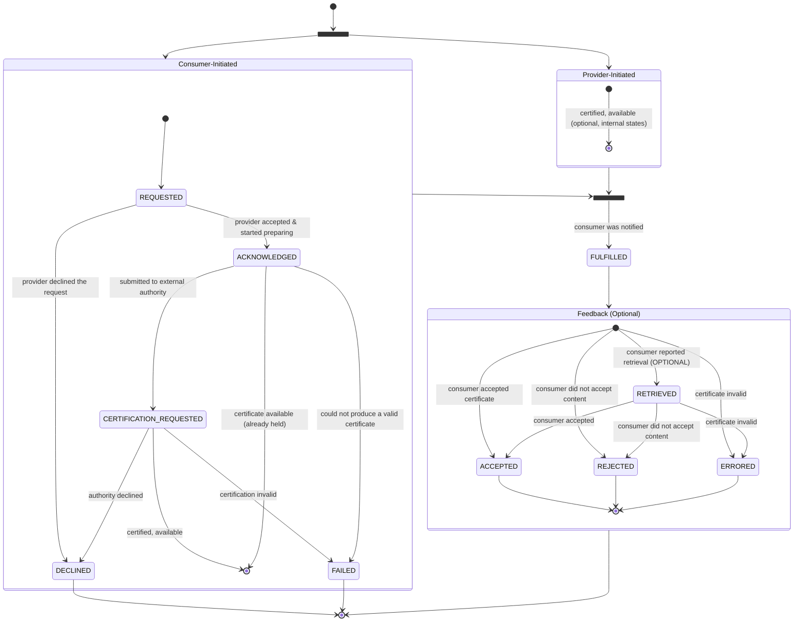
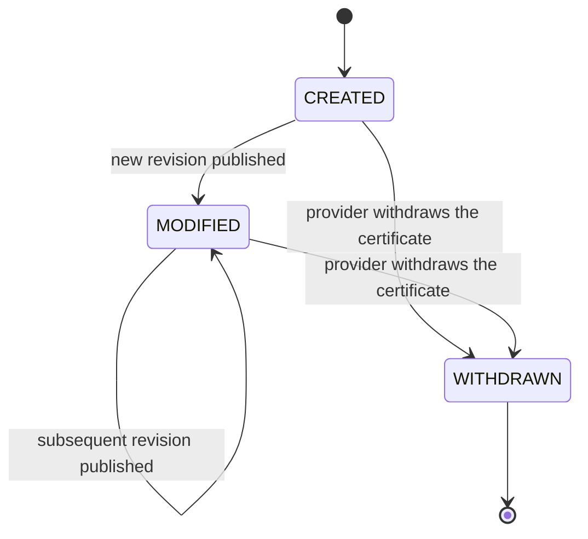

---
tags:
  - CAT/Value Added Services
---

# CX-0135 Business Partner Company Certificate Management (CCM) v3.0.0

## ABSTRACT

In the world of business, company certificates are often mandatory for conducting transactions between two companies.
However, the process of provisioning, maintaining, and validating these certificates can be a major challenge. For
example, if a company has 100 customers, it may need to provide its company certificates in 100 different ways and
maintain them at 100 different points. To address this, this standard defines a standardized but generic data model and
a wire protocol for company certificates.

## 1 Introduction

### 1.1 Audience & Scope

> *This section is non-normative*

This specification builds upon [CX-0151](#cx-0151) to define a Company Certificate Management (CCM) wire protocol for
exchanging company certificate data between Catena-X participants.

The following company certificate business requirements are supported in this release:

- Certificate Provider wants to create, modify, withdraw a certificate.
- Certificate Consumer wants to be notified about all changes to a certificate.
- Certificate Consumer wants to discover a published certificate.
- Certificate Consumer wants to request a certificate from a specific Certificate Provider.
- Certificate Consumer wants to provide Certificate Provider with feedback on a certificate.

This standard is relevant to the following parties:

- Data Provider and Consumer
- Business Application Provider
- Enablement Service Provider

It especially applies to Business Application Providers who aim to offer a solution for managing and exchanging company
certificates and returning them to customers, and to Data Providers and Consumers who manage and exchange certificates,
e.g., through such a business application.

> **Context regarding the naming of involved parties:**
> The Catena-X operating model and the [Dataspace Protocol](#dsp) use the roles `Data Consumer` and `Data Provider`,
> defined in terms of which party offers and consumes a dataset. In some cases these align with the direction of
> certificate flow, but — particularly for the notification mechanisms — a mismatch can occur. To avoid ambiguity,
> this standard uses the terms `Certificate Provider` and `Certificate Consumer` to designate the business entities,
> independently of the data-plane roles they assume for a given interaction.

### 1.2 Conformance and Proof Of Conformity

The keywords **MAY**, **MUST**, **MUST NOT**, **OPTIONAL**, **RECOMMENDED**, **REQUIRED**, **SHOULD**, and **SHOULD
NOT** in this document are to be interpreted as described in BCP 14 [RFC2119](#rfc2119) [RFC8174](#rfc8174) when, and
only when they appear in all capitals, as shown here.

- A participant **MAY** support any of the APIs (based on their need; more explicitly, a Consumer role without support
  of the Certificate Consumer API is valid):
    - Certificate Consumer API (see [Section 3.2](#32-certificate-consumer-api))
    - Certificate Provider API (see [Section 3.3](#33-certificate-provider-api))
- Business Application Provides **MUST** support both, the Certificate Provider API and the Certificate Consumer API.
- Based on the previous requirements, the participant **MUST** be compliant with all normative requirements defined in
  the respective sections of this standard. Especially the state machines, APIs and data model. Even a Consumer without
  a Certificate Consumer API **MUST** proof to be compliant with
  [Section 2](#2-relevant-parts-of-the-standard-for-specific-use-cases) and [Section 4](#4-aspect-models)
  of this standard.

> **Note:** three independent version numbers appear in this standard and are **not** expected to match. The document
> version (**v3.0.0**), the certificate aspect-model version
> ([io.catenax.business_partner_certificate](#sldt-business-partner-certificate-400) **4.0.0**), and the API/asset
> version (`cx-common:version` **3.0** and the OpenAPI `info.version` `3.0.0`) are independent.

## 2 RELEVANT PARTS OF THE STANDARD FOR SPECIFIC USE CASES

This section describes the conceptual model underpinning the specification wire protocol. It is background material: the
model introduces the entities and lifecycle that the normative sections build upon, but defines no normative
requirements of its own.

The model consists of two concepts:

- The `Certificate Exchange` ([Section 2.1](#21-certificate-exchange)) — a single, correlatable interaction in which one
  certificate is delivered from a Certificate Provider to a Certificate Consumer and its outcome is reported back. A
  `Certificate Exchange` has its own identity and a well-defined lifecycle.
- The `Certificate Lifecycle` ([Section 2.2](#22-certificate-lifecycle)) — the independent lifecycle of a certificate as
  an artifact (its creation, modification, and (optionally) withdrawal).

### 2.1 Certificate Exchange

A `Certificate Exchange` represents one end-to-end interaction between a Certificate Provider and a Certificate Consumer
involving the delivery of a single certificate from the time the interaction is started until it reaches a terminal
outcome.

#### 2.1.1 Identity and Correlation

> *This section is non-normative*

A `Certificate Exchange` is identified by an **`exchangeId`** assigned when it is started. The `exchangeId` is the
correlation handle for the entire interaction and is distinct from the identifier of any individual message or event
(for example, a CloudEvent `id` + `source`).

An exchange concerns a specific certificate, a (`certificateId`, `revision`) pair, and is conducted with a
`counterparty`, the authenticated Certificate Consumer.

A `Certificate Exchange` may be opened by the Certificate Consumer or Certificate Provider:

- **Consumer-Initiated:** the Certificate Consumer opens the exchange by requesting a certificate. The Certificate
  Provider assigns the `exchangeId` (together with the `certificateId` and `revision`) and returns them in the response.
  Every request opens an exchange — including one the Provider declines synchronously, which could open an exchange that
  terminates immediately at `DECLINED`; the identifiers are still returned so the outcome remains correlatable.
- **Provider-Initiated:** the Certificate Provider opens the exchange when a certificate is already available (e.g.,
  freshly created by a user of the certificate application without a previous consumer-initiated request), assigning an
  `exchangeId` and carrying it — with the `certificateId` and `revision` — in the notification.

**Idempotency.** Each `Certificate Exchange` has a unique `exchangeId`. A message that repeats an `exchangeId` refers to
the same exchange rather than opening a new one. Multiple exchanges **MAY** concern the same certificate and
`counterparty`.

Acceptance feedback is correlated to the exchange by its `exchangeId` for both flows.

A re-attempt after a terminal outcome — for example, re-evaluating a `REJECTED` or `ERRORED` certificate — is a new
`Certificate Exchange`, with a new `exchangeId`, for the same certificate.

#### 2.1.2 Phases and Ownership

> *This section is non-normative*

A `Certificate Exchange` progresses through two sequential phases, each owned by one party:

1. **Fulfillment (Provider-owned):** The Certificate Provider works to make the certificate available.
2. **Acceptance (Consumer-owned):** The Certificate Consumer retrieves and processes the certificate and reports the
   outcome.

The phases never overlap: the `Acceptance` phase begins only once `Fulfillment` has made the certificate available.
Provider-owned and Consumer-owned states use deliberately disjoint vocabulary, so the owner of a state is unambiguous.
Each phase can end in a negative decision or a business error: `DECLINED`/`REJECTED` are decisions (the Provider
declines the request, or the Consumer does not accept the certificate), while `FAILED`/`ERRORED` indicate a business
error such as an invalid certificate. These error states represent business-level problems only; technical and transport
failures (for example, connectivity errors or timeouts) are not modeled as `Certificate Exchange` states and are handled
at the transport layer.

#### 2.1.3 State Machine (Certificate Exchange)

> *This section is normative*

The states of a `Certificate Exchange` are defined below and use the past tense:



| State                     | Correlation        | Phase       | Owner    | Terminal | Description                                                                                                      |
|---------------------------|--------------------|-------------|----------|----------|------------------------------------------------------------------------------------------------------------------|
| `REQUESTED`               | Consumer-Initiated | Fulfillment | Provider | No       | The exchange was opened by the Consumer; the Provider has not yet acted.                                         |
| `ACKNOWLEDGED`            | Consumer-Initiated | Fulfillment | Provider | No       | The Provider accepted the request and began preparing the certificate.                                           |
| `CERTIFICATION_REQUESTED` | Consumer-Initiated | Fulfillment | Provider | No       | The Provider submitted the request to an external certification authority and is awaiting issuance. *(Optional)* |
| `FULFILLED`               | Consumer-Initiated | Fulfillment | Provider | No       | The certificate is prepared and available for retrieval and the Consumer was notified. Hand-off point.           |
| `DECLINED`                | Consumer-Initiated | Fulfillment | Provider | Yes      | The Provider declined the request (a business decision; e.g. the certificate type is not offered).               |
| `FAILED`                  | Consumer-Initiated | Fulfillment | Provider | Yes      | The Provider could not produce a valid certificate (a business error; e.g. the certificate is invalid).          |
| `RETRIEVED`               | -                  | Acceptance  | Consumer | No       | The Consumer fetched the certificate and is processing it. *(Optional — see the note below.)*                    |
| `ACCEPTED`                | -                  | Acceptance  | Consumer | Yes      | The Consumer accepted the certificate.                                                                           |
| `REJECTED`                | -                  | Acceptance  | Consumer | Yes      | The Consumer did not accept the certificate content (a business decision).                                       |
| `ERRORED`                 | -                  | Acceptance  | Consumer | Yes      | The Consumer found the certificate to be in error (a business error; e.g. the certificate is invalid).           |

##### 2.1.3.1 Consumer-Initiated

`REQUESTED` is instantaneous and internal to the Certificate Provider; it is never reported on the wire. The first
Fulfillment status a Certificate Consumer observes is the one carried in the request response (see
[Section 3.3.1](#331-certificate-request)), which is `ACKNOWLEDGED` or a later state. A Provider that can satisfy a
request without intermediate steps **MAY** report a later Fulfillment state directly — for example `FULFILLED` when the
certificate is already held, or `CERTIFICATION_REQUESTED` when the request is immediately forwarded to an external
authority — having passed through the earlier states instantly in an automated fashion. A reported `status` therefore
reflects the exchange's current state, not necessarily a single transition from the one before it.

##### 2.1.3.2 Provider-Initiated

A provider-initiated exchange enters the lifecycle at `FULFILLED` (with potential internal states beforehand when a user
creates a certificate). There is no request, so `REQUESTED`, `ACKNOWLEDGED` and `CERTIFICATION_REQUESTED` are never
visited.

##### 2.1.3.3 Feedback

Any feedback is optional.
`RETRIEVED` is a non-terminal acknowledgment that the Consumer has fetched the certificate and is evaluating it; the
Consumer **MAY** report it as a delivery receipt but is not required to. An exchange therefore reaches a terminal
acceptance state either by way of `RETRIEVED`
(`FULFILLED → RETRIEVED → {ACCEPTED, REJECTED, ERRORED}`)
or directly from `FULFILLED` (`FULFILLED → {ACCEPTED, REJECTED, ERRORED}`). The terminal acceptance verdicts remain
consumer-owned in both cases. If the Consumer never provides any feedback, the terminal state is never reached for that
exchange; it remains in `FULFILLED` indefinitely.

#### 2.1.4 Terminal States and Immutability

A `Certificate Exchange` is single-shot. The five terminal states — `DECLINED`, `FAILED`, `ACCEPTED`, `REJECTED`, and
`ERRORED` — conclude the exchange permanently. A terminal exchange is never reopened, reused, or transitioned further.

#### 2.1.5 Relationship to the Certificate Lifecycle

A `Certificate Exchange` governs the *delivery* of a certificate, not the certificate itself. Modifications, updates,
and revocations of a certificate are changes to the certificate artifact and are **not** transitions of a
`Certificate Exchange.` In particular, a change to a certificate that has already been delivered does not reopen or
alter the (possibly terminal) exchange that delivered it. A modification revises the certificate in place under the same
`certificateId` and does not open a new `Certificate Exchange.` The certificate's own lifecycle is described in
[Section 2.2](#22-certificate-lifecycle).

### 2.2 Certificate Lifecycle

The `Certificate Lifecycle` tracks a certificate as an artifact over time, independently of how many times it is
delivered. Whereas a `Certificate Exchange` is single-shot and concerns one delivery interaction, a certificate is
long-lived: it may be published, revised, and eventually withdrawn.

#### 2.2.1 Identity and Versioning

A certificate is identified by a **`certificateId`** that is stable for the life of the certificate. A modification does
not create a new identifier; instead, the certificate is versioned by a **`revision`** counter:

- `CREATED` makes the first `revision` of the certificate available for retrieval.
- Each `MODIFIED` publishes a new `revision` under the same `certificateId`, superseding the previous one. The latest
  `revision` is authoritative.
- A certificate is therefore identified by the pair (`certificateId`, `revision`). A `Certificate Exchange` delivers one
  specific `revision`.

The `certificateId` and the initial `revision` number may be assigned before the certificate is published. When a
Certificate Provider accepts a Consumer's request and produces the certificate only later (see
[Section 2.1.1](#211-identity-and-correlation)), the identifier is allocated at acceptance so that an in-progress
`Certificate Exchange` can reference its certificate. Publication (`CREATED`) then occurs when the certificate becomes
available.

A certificate covers a **fixed set of locations** — the legal entity (BPNL), sites (BPNS), and addresses (BPNA) it
applies to. On the certificate record these are carried as the structured `certifiedLocations` array (each entry
identifying a location and its role, with an optional per-location area of application; see
[Section 4.2.4](#424-certified-locations)). The location set is a static property of the certificate; a certificate that
would cover a different set of locations is a distinct certificate.

#### 2.2.2 State Machine (Certificate Lifecycle)

> *This section is normative*

The states use the past tense and describe the *publication* lifecycle of the certificate. They are independent of the
certificate's validity (see [Section 2.2.3](#223-validity-as-a-separate-dimension)).



| State       | Terminal | Description                                                                                                                 |
|-------------|----------|-----------------------------------------------------------------------------------------------------------------------------|
| `CREATED`   | No       | The certificate was first published under a new `certificateId`, establishing its initial version (`revision` 0).           |
| `MODIFIED`  | No       | A new `revision` of the certificate was published under the same `certificateId`; the `revision` is incremented. May recur. |
| `WITHDRAWN` | Yes      | The Provider withdrew (removed) the certificate; it is no longer available. Terminal.                                       |

#### 2.2.3 Validity as a Separate Dimension

> *This section is non-normative*

A certificate's validity is an independent dimension derived from its `validFrom` and `validUntil` dates, not from the
publication states defined above. A given `revision` is *active* within its validity window and *expired* afterward, and
this status changes with the passage of time alone — no lifecycle transition occurs. The two dimensions are orthogonal:
a certificate MAY be `WITHDRAWN` while still within its validity window, or remain `CREATED`/`MODIFIED`after it has
expired.

#### 2.2.4 Relationship to the `Certificate Exchange`

> *This section is non-normative*

Of the publication events, only `CREATED` MAY open a new `Certificate Exchange` to deliver the certificate — whether
pushed by the Provider or discovered and requested by the Consumer. `MODIFIED` and `WITHDRAWN` do not open an exchange: a
modification revises the certificate in place under the same `certificateId` without initiating a new delivery, and a
withdrawal ends the certificate's availability. Consistent with
[Section 2.1.5](#215-relationship-to-the-certificate-lifecycle), a lifecycle transition never alters an existing
`Certificate Exchange.` These transitions are communicated to Certificate Consumers as certificate lifecycle events (see
[Section 3.2.1](#321-certificate-lifecycle-events)).

## 3 APPLICATION PROGRAMMING INTERFACES

> *This section is normative*

The API specification is separated in two parts, one for the Certificate Provider and one for the Certificate Consumer.
A network participant is not limited to either of those roles; for example, a participant could be a Certificate
Consumer in one interaction and a Certificate Provider in another.

Which APIs a participant exposes depends on its capabilities:

| To…                                                             | Certificate Provider API ([Section 3.3](#33-certificate-provider-api)) | Certificate Consumer API ([Section 3.2](#32-certificate-consumer-api))      |
|-----------------------------------------------------------------|------------------------------------------------------------------------|-----------------------------------------------------------------------------|
| offer certificates to other participants                        | **MUST** expose                                                        | —                                                                           |
| receive lifecycle notifications and provide acceptance feedback | —                                                                      | **MUST** expose (register `…ConsumerApi` or `…ConsumerEmbeddedDocumentApi`) |
| act as a Business Application Provider                          | **MUST** expose                                                        | **MUST** expose                                                             |

Requesting and retrieving certificates from a Provider requires no exposed API — a Certificate Consumer calls the
Certificate Provider API directly.

This section introduces the certificate management notification API which is based on the following OpenAPI
specifications which **MUST** be adhered to:

- [Certificate Consumer API](assets/certificate-consumer-api.yaml)
- [Certificate Provider API](assets/certificate-provider-api.yaml)

The OpenAPI specification **MUST** be used as the baseline, the following subsections add additional normative
requirements and clarifications. Each supported API **MUST** be discoverable and made accessible via
a [DSP Catalog](#dsp-catalog).

A dataspace participant that chooses to implement an API **MUST**

- offer an asset to expose the API for Certificate Provider in the DSP catalog.
- reference the name of the certificate management API `cx-taxo:CCMAPI` for the property
  [[type]](https://www.dublincore.org/specifications/dublin-core/dcmi-terms/#type).

Overview of possible API assets defined in this version of the standard:

| **Type**       | **Subject**                                                     | **Version** | **Description**                                                                                                                                                                                                                                                                                        |
|----------------|-----------------------------------------------------------------|-------------|--------------------------------------------------------------------------------------------------------------------------------------------------------------------------------------------------------------------------------------------------------------------------------------------------------|
| cx-taxo:CCMAPI | cx-taxo:CompanyCertificateManagementConsumerApi                 | 3.0         | Offers *Certificate Consumer API* according to [Section 3.2](#32-certificate-consumer-api) for receiving notifications on certificate lifecycle events and providing feedback on the status of provided certificates.                                                                                  |
| cx-taxo:CCMAPI | cx-taxo:CompanyCertificateManagementConsumerEmbeddedDocumentApi | 3.0         | Variant of the *Certificate Consumer API* that additionally receives certificate documents embedded inline in `CREATED`/`MODIFIED` lifecycle notifications (see [Section 3.2.1](#321-certificate-lifecycle-events)). A Certificate Consumer registers either this subject or `…ConsumerApi`, not both. |
| cx-taxo:CCMAPI | cx-taxo:CompanyCertificateManagementProviderApi                 | 3.0         | Offers *Certificate Provider API* according to [Section 3.3](#33-certificate-provider-api) for requesting certificates, retrieving certificates, providing feedback on the status of certificate requests, and searching for certificates.                                                             |

There **MUST** only be one unique asset per API (subject and version) for a participant.
___
*Example*: it is possible to have these assets available next to one-another:

- ```{ "dct:subject": { "@id": "cx-taxo:CompanyCertificateManagementConsumerApi" }, "cx-common:version": "3.0" }```,
- ```{ "dct:subject": { "@id": "cx-taxo:CompanyCertificateManagementProviderApi" }, "cx-common:version": "3.0" }```,
- ```{ "dct:subject": { "@id": "cx-taxo:CompanyCertificateManagementProviderApi" }, "cx-common:version": "4.0" }```

since they either differ in the value of the version or the subject. But it would not be possible to have two of the
same subject and the same version.

*Example that is not allowed:*

- ```{"dct:subject": { "@id": "cx-taxo:CompanyCertificateManagementConsumerApi" }, "cx-common:version": "3.0" }```,
- ```{"dct:subject": { "@id": "cx-taxo:CompanyCertificateManagementConsumerApi" }, "cx-common:version": "3.0" }```

The two assets above are not allowed, because they share both the same subject and the same version.
___

### 3.1 Security and Authorization

> *This section is normative*

**Transport.** All endpoints defined in this standard **MUST** be exposed over HTTPS (HTTP over TLS 1.2 or higher).

**Authorization.** Access to every CCM API and to certificate data is mediated by the Dataspace Protocol: a caller
**MUST** have negotiated a contract for the relevant asset and **MUST** present the resulting access token (token
handling as defined in [CX-0000](#cx-0000)). Use of the data is bound by the usage policy in
[Section 3.5](#35-usage-policy), including the `cx.ccm.base:1` usage purpose.

**Sender identity.** Every CCM CloudEvent carries the asserting party's BPN in its `source` attribute. The recipient
**MUST** verify that `source` matches the authenticated identity of the sender and **MUST** reject the event when they
do not match:

- A Certificate Consumer **MUST** reject a certificate lifecycle or fulfillment notification (see
  [Section 3.2.1](#321-certificate-lifecycle-events)) whose `source` does not match the authenticated Certificate
  Provider.
- A Certificate Provider **MUST** reject an acceptance status event (see
  [Section 3.3.3](#333-certificate-acceptance)) whose `source` does not match the authenticated Certificate Consumer.

**Document confidentiality.** Certificate documents are confidential. A document's `contentBase64` **MUST** be delivered
inline only to a Certificate Consumer registered under the
`cx-taxo:CompanyCertificateManagementConsumerEmbeddedDocumentApi` subject and authorized via its negotiated contract;
document binaries (`GET /documents/{id}`) **MUST** be served only over the authenticated channel.

### 3.2 Certificate Consumer API

> API specification:
> [Certificate Consumer API](assets/certificate-consumer-api.yaml)

The Certificate Consumer API enables a Certificate Consumer to receive notifications from Certificate Provider (as
certificate lifecycle events, see [Section 2.2](#22-certificate-lifecycle)) and provide certificate acceptance status
for open exchanges (see [Section 3.2.2](#322-certificate-acceptance-status-query)):

This API is optional; a Certificate Consumer that does not wish to receive notifications or provide certificate
acceptance status updates is not required to implement it. A Certificate Consumer that does implement it **MUST**
adhere to the following normative requirements (as well as further requirements defined in this section):

- The Certificate Consumer signals to the Certificate Provider the existence of the API by the availability of the data
  asset. If no data asset is available, the Certificate Provider is relieved of their obligation to push notifications.
  If the Certificate Consumer wishes to receive notifications, they **MUST** provide the data asset.
- If the data asset exists, the Certificate Consumer **MUST** serve all specified endpoints and implement at least one
  of them, but **MAY** return `HTTP 501` for endpoints it does not wish to implement. For example, a Consumer that wants
  to receive notifications but does not want to provide acceptance status updates could return `HTTP 501` for the
  acceptance status endpoint.
- reference, for the property [[subject]](https://www.dublincore.org/specifications/dublin-core/dcmi-terms/#subject),
  exactly one of the two Certificate Consumer API subjects: `cx-taxo:CompanyCertificateManagementConsumerApi` (lifecycle
  notifications carry document references only) or `cx-taxo:CompanyCertificateManagementConsumerEmbeddedDocumentApi`
  (lifecycle notifications additionally embed inline documents, see [Section 3.2.1](#321-certificate-lifecycle-events)).
- reference the version of the API according to the OpenAPI specification for the property
  [[version]](https://w3id.org/catenax/ontology/common#version): `3.0`

A Certificate Provider **MUST** push notifications to a Certificate Consumer that implements this API (and therefore
**MUST** check for its existence), and **MUST** follow the requirements defined in this section when doing so. This
obligation applies only to the endpoints the Certificate Consumer actually serves: if the Certificate Consumer returns
`HTTP 501` for an endpoint (see above), the Certificate Provider is relieved of the obligation to push to that endpoint.
Polling (`GET /certificate-requests/{id}`, [Section 3.3.1](#331-certificate-request)) remains available as a fallback
and is not a substitute for the push obligation.

The API is based on CloudEvents (see [CloudEvents](#cloudevents)) and **MUST** follow the HTTP binding defined in
[CloudEvents-HTTP](#cloudevents-http).

#### 3.2.1 Certificate Lifecycle Events

`POST /certificate-notifications`

The endpoint accepts a single CloudEvent or a batch (a JSON array) and follows the state machine defined in
[Section 2.1.3](#213-state-machine-certificate-exchange).

The event **MUST** be one of the following **Event Type**:

- `org.catena-x.ccm.CertificateLifecycleStatus.v1`
- `org.catena-x.ccm.CertificateFulfillmentStatus.v1`

The Certificate Provider **MUST** push notifications for all states from
[2.2.2 State Machine](#222-state-machine-certificate-lifecycle) as Certificate Lifecycle Status. An example notification
history could be:
The Certificate Provider pushes a `CREATED` notification (this would always be the case), and a few days later a
`MODIFIED` notification, because an error in the certificate record had to be corrected. A few years later the Provider
could push a `WITHDRAWN` notification, because the certificate is no longer valid. This last step is not mandatory,
because a Provider could decide to still keep the certificate available, even if it is expired.

The `data` payload of a Certificate Lifecycle Status event has the following top-level structure:

| Property      | Type   | Presence                | Description                                                                                                                                            |
|---------------|--------|-------------------------|--------------------------------------------------------------------------------------------------------------------------------------------------------|
| `status`      | String | MANDATORY               | One of `CREATED`, `MODIFIED`, `WITHDRAWN`.                                                                                                             |
| `exchangeId`  | String | MANDATORY for `CREATED` | Identifier of the provider-initiated exchange opened by the `CREATED` event; absent otherwise.                                                         |
| `certificate` | Object | MANDATORY               | The certificate record (see [Section 4](#4-aspect-models)). How much of it is populated depends on the Certificate Consumer's API subject (see below). |

The field set carried inside `certificate` for a `CREATED`/`MODIFIED` event depends on which Certificate Consumer API
subject the Consumer registered (see [Section 3.2](#32-certificate-consumer-api)):

| `certificate` field                                                  | Baseline (`…ConsumerApi`) | Embedded (`…ConsumerEmbeddedDocumentApi`)      |
|----------------------------------------------------------------------|---------------------------|------------------------------------------------|
| `certificateId`                                                      | MANDATORY                 | MANDATORY                                      |
| `revision`                                                           | MANDATORY                 | MANDATORY                                      |
| `certificateType`                                                    | MANDATORY                 | MANDATORY                                      |
| `validFrom`, `validUntil`                                            | MANDATORY                 | MANDATORY                                      |
| `registrationNumber`, `trustLevel`                                   | absent                    | MANDATORY                                      |
| `certifiedLocations`                                                 | absent                    | MANDATORY                                      |
| `certificateTypeVersion`, `areaOfApplication`, `issuer`, `validator` | absent                    | OPTIONAL                                       |
| `documents`                                                          | absent                    | MANDATORY, each entry carrying `contentBase64` |

The baseline subset lets a Consumer triage relevance (type, validity) without retrieving. The embedded form carries the
**complete** certificate record — identical to the `GET /certificates/{id}` response
([Section 3.3.2](#332-certificate-retrieval)) — plus the inline document content, so an opted-in Consumer needs no
separate retrieval. A `WITHDRAWN` event carries only `certificate.certificateId` (with `status`).

The Certificate Provider **MUST** also push notifications for all provider-owned terminal states from
[2.1.3 State Machine](#213-state-machine-certificate-exchange) as Certificate Fulfillment Status.

> [!Important]
> **Push Mechanism explanation**
>
> Previous versions of the standard made a distinction between a dedicated push and a pull mechanism.
> This standard consolidates both into a single mechanism.
> To still support the push mechanism, the Certificate Lifecycle Events endpoint has a unique functionality.
> Usually the notification carries only the lifecycle event, without any document content.
> However, the following explains how a lifecycle event **MAY** also carry the certificate's documents inline.

A Certificate Consumer that wants the full certificate record and document content delivered inline with its lifecycle
events registers its Certificate Consumer API asset under the subject
`cx-taxo:CompanyCertificateManagementConsumerEmbeddedDocumentApi` instead of
`cx-taxo:CompanyCertificateManagementConsumerApi` (see [Section 3.2](#32-certificate-consumer-api)). The two subjects
describe the same endpoints; they differ only in how much of `data.certificate` is populated on `CREATED`/`MODIFIED`
notifications. A Certificate Consumer **MUST** register exactly one of the two Consumer subjects.

When the Certificate Consumer's asset declares the plain `cx-taxo:CompanyCertificateManagementConsumerApi` subject, the
Certificate Provider **MUST** populate `data.certificate` with the triage subset only (`certificateId`,
`revision`, `certificateType`, `validFrom`, `validUntil`) and **MUST NOT** include `registrationNumber`, `trustLevel`,
`certifiedLocations`, `issuer`, `validator`, or `documents`.

When the Certificate Consumer's asset declares the `cx-taxo:CompanyCertificateManagementConsumerEmbeddedDocumentApi`
subject, the Certificate Provider **MUST**, for `CREATED`/`MODIFIED` events, populate `data.certificate` with the
**complete** certificate record as defined for `GET /certificates/{id}` ([Section 3.3.2](#332-certificate-retrieval)),
**and MUST** include the `documents` array. Each document entry **MUST** contain `documentId`, `createdDate`,
`mediaType`, and `contentBase64`, and **MAY** contain `language`. (Unlike the retrieval response, where document content
is forbidden, embedded documents **MUST** include `contentBase64`.)

For a `WITHDRAWN` event (either subject), `data.certificate` carries only `certificateId`. Fulfillment events
(`org.catena-x.ccm.CertificateFulfillmentStatus.v1`) never carry a certificate record.

The above **MUST** also be respected for batch notifications.

The following is a non-normative example of a `CREATED` notification to a Consumer registered under the
`cx-taxo:CompanyCertificateManagementConsumerApi` subject:

```json
{
  "specversion": "1.0",
  "type": "org.catena-x.ccm.CertificateLifecycleStatus.v1",
  "source": "urn:bpn:BPNL0000000001AB",
  "subject": "BPNL0000000002CD",
  "id": "a1b2c3d4-5e6f-7a8b-9c0d-1e2f3a4b5c6d",
  "time": "2025-05-04T07:00:00Z",
  "datacontenttype": "application/json",
  "data": {
    "status": "CREATED",
    "exchangeId": "exch-7f3a9c12-4b8e-4d6a-9e21-0c5b2a1d8f44",
    "certificate": {
      "certificateId": "cert-550e8400-e29b-41d4-a716-446655440000",
      "revision": 1,
      "certificateType": "iso9001",
      "validFrom": "2023-01-25",
      "validUntil": "2026-01-24"
    }
  }
}
```

The following is a non-normative example of a `CREATED` notification to a Consumer registered under the
`CompanyCertificateManagementConsumerEmbeddedDocumentApi` subject:

```json
{
  "specversion": "1.0",
  "type": "org.catena-x.ccm.CertificateLifecycleStatus.v1",
  "source": "urn:bpn:BPNL0000000001AB",
  "subject": "BPNL0000000002CD",
  "id": "e7c9a1b2-3d4e-5f6a-7b8c-9d0e1f2a3b4c",
  "time": "2025-05-04T07:00:00Z",
  "datacontenttype": "application/json",
  "data": {
    "status": "CREATED",
    "exchangeId": "exch-7f3a9c12-4b8e-4d6a-9e21-0c5b2a1d8f44",
    "certificate": {
      "certificateId": "cert-550e8400-e29b-41d4-a716-446655440000",
      "revision": 1,
      "certificateType": "iso9001",
      "registrationNumber": "12 100 4711",
      "validFrom": "2023-01-25",
      "validUntil": "2026-01-24",
      "trustLevel": "high",
      "certifiedLocations": [
        {
          "bpnl": "BPNL00000001AXS",
          "bpna": "BPNA00000001AXS",
          "bpns": "BPNS00000001AXS",
          "locationRole": "MAIN_LOCATION"
        }
      ],
      "documents": [
        {
          "documentId": "doc-3fa85f64-5717-4562-b3fc-2c963f66afa6",
          "createdDate": "2023-01-25",
          "language": "en",
          "mediaType": "application/pdf",
          "contentBase64": "JVBERi0xLjQKJ..."
        }
      ]
    }
  }
}
```

A Certificate Provider pushes a **fulfillment status** notification to report the outcome of a Consumer's certificate
request, such as the certificate becoming available (`FULFILLED`). The following is a non-normative example of a
**fulfillment status** notification:

```json
{
  "specversion": "1.0",
  "type": "org.catena-x.ccm.CertificateFulfillmentStatus.v1",
  "source": "urn:bpn:BPNL0000000001AB",
  "subject": "BPNL0000000002CD",
  "id": "f0e1d2c3-b4a5-6789-0abc-def012345678",
  "time": "2025-05-04T07:30:00Z",
  "datacontenttype": "application/json",
  "data": {
    "exchangeId": "exch-7f3a9c12-4b8e-4d6a-9e21-0c5b2a1d8f44",
    "certificateId": "cert-550e8400-e29b-41d4-a716-446655440000",
    "status": "FULFILLED"
  }
}
```

When `status` is `DECLINED` or `FAILED`, the `data` **MUST** also include a non-empty `errors` array (for example,
`"errors": [ { "message": "Certificate type not offered for the requested location" } ]`).

#### 3.2.2 Certificate Acceptance Status Query

`GET  /certificate-acceptance-status/{id}`

This endpoint allows a Certificate Provider to query the current acceptance status of a `Certificate Exchange` it
opened. The `{id}` path parameter **MUST** be the `exchangeId` assigned when the exchange was opened (see
[Section 2.1.1](#211-identity-and-correlation)). It is the pull counterpart of the acceptance status the Certificate
Consumer otherwise reports via `POST /certificate-acceptance-notifications` (see
[Section 3.3.3](#333-certificate-acceptance)); both convey an Acceptance-phase state (`RETRIEVED`, `ACCEPTED`,
`REJECTED`, or `ERRORED`) of the Certificate Exchange as defined in
[Section 2.1.3](#213-state-machine-certificate-exchange).

If the `exchangeId` is unknown to the Certificate Consumer, it **MUST** respond with `HTTP 404`. A Certificate Consumer
that does not implement this endpoint **MAY** respond with `HTTP 501` (see [Section 3.2](#32-certificate-consumer-api)).

### 3.3 Certificate Provider API

> API specification:
> [Certificate Provider API](assets/certificate-provider-api.yaml)

The Certificate Provider API enables Certificate Providers to accept certificate requests, report request fulfillment
status, serve certificate data, answer certificate queries, and receive acceptance status from Certificate Consumers.

The Certificate Provider **MUST**:

- implement this API in its total, supporting all endpoints.
- reference the name of the Certificate Provider API: `cx-taxo:CompanyCertificateManagementProviderApi` for the property
  [[subject]](https://www.dublincore.org/specifications/dublin-core/dcmi-terms/#subject).
- reference the version of the API according to the OpenAPI specification for the property
  [[version]](https://w3id.org/catenax/ontology/common#version): `3.0`

#### 3.3.1 Certificate Request

`POST /certificate-requests`,
`GET  /certificate-requests/{id}`

The Certificate Provider **MUST** respond with request states according to
[2.1.3 State Machine](#213-state-machine-certificate-exchange).

#### 3.3.2 Certificate Retrieval

`GET  /certificates/{id}`
`GET  /documents/{id}`

The `/certificates/{id}` endpoint **MUST** return the certificate as a JSON object conforming to the certificate data
model defined in [Section 4.1](#41-aspect-model-business-partner-certificate), as specified by the
[Certificate Provider API](assets/certificate-provider-api.yaml) OpenAPI specification.

The `/certificates/{id}` response includes document references only and never the document content. To receive a
document's content, the Consumer **MUST** either use `GET /documents/{id}` with the `documentId` from the certificate
record, or — when it is registered under the embedded-document subject — receive it inline in the certificate embedded
in a lifecycle notification (`data.certificate.documents[].contentBase64`, see
[Section 3.2.1](#321-certificate-lifecycle-events)).

A **withdrawn** certificate (lifecycle state `WITHDRAWN`, see
[Section 2.2](#22-certificate-lifecycle)) need not remain retrievable: for a withdrawn certificate the Provider **MAY**
cease returning the certificate record and its documents. The Provider **MUST**, however, retain the fact that the
certificate was withdrawn and make it observable — for a withdrawn `certificateId`, `GET /certificates/{id}` **MUST**
return `HTTP 200` with the minimal status body `{ "certificateId": "…", "status": "WITHDRAWN" }` (no metadata or
documents), so a Certificate Consumer that holds the `certificateId` can confirm the withdrawal via the Certificate
Provider API even after the certificate data is no longer served. An unknown `certificateId` still returns `HTTP 404`.

#### 3.3.3 Certificate Acceptance

`POST /certificate-acceptance-notifications`

This API is used by the Certificate Consumer to provide feedback on the status to the Certificate Provider, either
accepting or rejecting the provided certificate. It is based on CloudEvents (see [CloudEvents](#cloudevents)). The event
**MUST** be of **Event Type** `org.catena-x.ccm.CertificateAcceptanceStatus.v1`. The contents of the feedback message
**MUST** be included in the `data` section of the CloudEvent, with `data.status` set to one of the Acceptance-phase
states (`RETRIEVED`, `ACCEPTED`, `REJECTED`, `ERRORED`) according to the lifecycle of the Certificate Exchange as
defined in [Section 2.1.3](#213-state-machine-certificate-exchange).

The following is a non-normative example of an `ACCEPTED` acceptance status event:

```json
{
  "specversion": "1.0",
  "type": "org.catena-x.ccm.CertificateAcceptanceStatus.v1",
  "source": "urn:bpn:BPNL0000000002CD",
  "subject": "BPNL0000000001AB",
  "id": "a7b8c9d0-e1f2-3a4b-5c6d-7e8f9a0b1c2d",
  "time": "2025-05-04T09:00:00Z",
  "datacontenttype": "application/json",
  "data": {
    "exchangeId": "exch-7f3a9c12-4b8e-4d6a-9e21-0c5b2a1d8f44",
    "certificateId": "cert-550e8400-e29b-41d4-a716-446655440000",
    "status": "ACCEPTED"
  }
}
```

For `REJECTED` or `ERRORED`, the `data` **MUST** include a non-empty `errors` array; each error has a `message` and an
optional `specifier` scoping it to a certificate element (for example, a site BPN):

```json
{
  "specversion": "1.0",
  "type": "org.catena-x.ccm.CertificateAcceptanceStatus.v1",
  "source": "urn:bpn:BPNL0000000002CD",
  "subject": "BPNL0000000001AB",
  "id": "f1a2b3c4-d5e6-7f8a-9b0c-1d2e3f4a5b6c",
  "time": "2025-05-04T09:00:00Z",
  "datacontenttype": "application/json",
  "data": {
    "exchangeId": "exch-7f3a9c12-4b8e-4d6a-9e21-0c5b2a1d8f44",
    "certificateId": "cert-550e8400-e29b-41d4-a716-446655440000",
    "status": "REJECTED",
    "errors": [
      {
        "message": "Certificate has expired"
      },
      {
        "specifier": "BPNS000000000002",
        "message": "Site BPNS000000000002 was rejected"
      }
    ]
  }
}
```

#### 3.3.4 Certificate Query

`POST /certificates/search`

The Certificate Provider **MUST** expose a search endpoint at `POST /certificates/search` that accepts the constrained
query structure defined in this section. The request body **MUST** be a single JSON object with the following structure:

- `$condition` — the root of the query (**MANDATORY**).
- `$match` — an array of comparison clauses. A certificate matches only if it satisfies **every** clause in the array
  (logical **AND**).
- Each clause **MUST** be an object with:
    - `$field` — a string path identifying the field to compare, referencing the certificate data model
      (see [Section 4.1](#41-aspect-model-business-partner-certificate)).
    - `$eq` — the string value the field **MUST** equal.

A Certificate Provider **MUST** support exactly the following subset and **MAY** support more:

- Operators: `$match`, `$eq`.
- Fields: `certifiedLocations.bpnl`, `certifiedLocations.bpns`, `certifiedLocations.bpna`, `certificateType`.
- Matches, each as a `{$field, $eq}` clause:
    - `$field`: `certifiedLocations.bpnl`, `$eq`: any valid BPNL as string.
    - `$field`: `certifiedLocations.bpns`, `$eq`: any valid BPNS as string.
    - `$field`: `certifiedLocations.bpna`, `$eq`: any valid BPNA as string.
    - `$field`: `certificateType`, `$eq`: any allowed certificate type.

A Certificate Provider that receives a query using an operator or field it does not support **MUST** reject the request
with `HTTP 501`.

The response body **MUST** be a JSON array of certificate records, each carrying the full certificate metadata for the
latest `revision` (without document binaries), as defined by the
[Certificate Provider API](assets/certificate-provider-api.yaml) OpenAPI specification. A Certificate Consumer retrieves
a certificate via `GET /certificates/{id}` using its `certificateId`. Implementations **MAY**
paginate the results; when they do, pagination **MUST** be conveyed using Web Linking ([RFC8288](#rfc8288)) via the HTTP
`Link` response header, supporting at least the `next` and `prev` relations.

> **Note (non-normative):** the query structure above is a constrained profile of, and wire-compatible with, the
> Registry Service Specification — Query Profile (SSP-004) referenced by [CX-0002](#cx-0002). Conformance to this
> standard requires only the subset defined in this section; implementing SSP-004 in full is **NOT** required.
___
**Example query 1** *(non-normative)*

```json
{
  "$condition": {
    "$match": [
      {
        "$field": "certifiedLocations.bpnl",
        "$eq": "BPNL00000001AXS"
      },
      {
        "$field": "certifiedLocations.bpns",
        "$eq": "BPNS00000001AXS"
      },
      {
        "$field": "certifiedLocations.bpna",
        "$eq": "BPNA00000001AXS"
      }
    ]
  }
}
```

This example would return all certificates that match all the following conditions:

- the certificate contains a certifiedLocations with BPNL: `BPNL00000001AXS`
- and the certificate contains a certifiedLocations with BPNS: `BPNS00000001AXS`
- and the certificate contains a certifiedLocations with BPNA: `BPNA00000001AXS`

**Example query 2** *(non-normative)*

```json
{
  "$condition": {
    "$match": [
      {
        "$field": "certifiedLocations.bpnl",
        "$eq": "BPNL00000001AXS"
      },
      {
        "$field": "certificateType",
        "$eq": "iso14001"
      }
    ]
  }
}
```

This example would return all certificates that match all the following conditions:

- the certificate contains a certifiedLocations with BPNL: `BPNL00000001AXS`
- and the certificate has the certificate type `iso14001`

**Example query result** *(non-normative)*

The response to a query (for example, Example query 2 above) is a JSON array of certificate records. Each record carries
the full certificate metadata for the latest `revision`; document content is never included — a Consumer retrieves a
document binary via `GET /documents/{id}` using its `documentId`.

```json
[
  {
    "certificateId": "cert-550e8400-e29b-41d4-a716-446655440000",
    "revision": 1,
    "certificateType": "iso14001",
    "certificateTypeVersion": "2015",
    "registrationNumber": "12 100 4711",
    "validFrom": "2023-01-25",
    "validUntil": "2026-01-24",
    "trustLevel": "high",
    "certifiedLocations": [
      {
        "bpnl": "BPNL00000001AXS",
        "bpna": "BPNA00000001AXS",
        "bpns": "BPNS00000001AXS",
        "locationRole": "MAIN_LOCATION"
      }
    ],
    "issuer": {
      "issuerName": "TÜV Süd",
      "issuerBpn": "BPNL0000000003EF"
    },
    "documents": [
      {
        "documentId": "doc-3fa85f64-5717-4562-b3fc-2c963f66afa6",
        "createdDate": "2023-01-25",
        "language": "en",
        "mediaType": "application/pdf"
      }
    ]
  }
]
```

___

### 3.4 Policy Constraints for Data Exchange

Access and usage policies for the CCM APIs and certificate datasets **MUST** conform to [CX-0152](#cx-0152); the
specific CCM usage policy is defined in [Section 3.5](#35-usage-policy).

### 3.5 Usage Policy

All dataspace offers — both the APIs defined in this standard and the certificate datasets — **MUST** carry a usage
policy following the requirements referenced in [Section 3.4](#34-policy-constraints-for-data-exchange). This use case
introduces the following usage purpose:

- **`cx.ccm.base:1`** — *the legal meaning is defined in [CX-0152](#cx-0152) (see the Catena-X standard library).*

Additional, more general usage policies **MAY** be included, but every usage policy **MUST** contain the previous usage
purpose, as shown below.

The usage policy is carried under the offering Dataset's `odrl:hasPolicy` — it is part of a Dataset (see
[Section 3.6](#36-dsp-dataset-representation) for the complete Dataset, including its `@context`). The following
illustrates a non-normative minimal policy offer:

```json
{
  "odrl:hasPolicy": [
    {
      "@id": "CCMAPI-usage-policy",
      "permission": [
        {
          "action": "use",
          "constraint": {
            "and": [
              {
                "leftOperand": "FrameworkAgreement",
                "operator": "eq",
                "rightOperand": "DataExchangeGovernance:1.0"
              },
              {
                "leftOperand": "UsagePurpose",
                "operator": "isAnyOf",
                "rightOperand": "cx.ccm.base:1"
              }
            ]
          }
        }
      ]
    }
  ]
}
```

The constraint `{ "leftOperand": "ContractReference" }` **MUST** be included only if such a bilateral framework contract
exists:

```json
{
  "leftOperand": "ContractReference",
  "operator": "isAllOf",
  "rightOperand": "x12345"
}
```

### 3.6 DSP Dataset Representation

> *This section is non-normative.*

A participant offers each supported API as a Dataset in its Dataspace Protocol catalog
(see [DSP-Catalog](#dsp-catalog)). The Dataset carries the API's `dct:type`, `dct:subject`, and `cx-common:version` (per
the asset table in [Section 3](#3-application-programming-interfaces)) together with a usage policy as required by
[Section 3.5](#35-usage-policy). The following are non-normative examples.

*Certificate Consumer API dataset (a Consumer wanting inline documents would instead use the subject
`cx-taxo:CompanyCertificateManagementConsumerEmbeddedDocumentApi`):*

```json
{
  "@context": [
    "https://w3id.org/catenax/2025/9/policy/odrl.jsonld",
    "https://w3id.org/catenax/2025/9/policy/context.jsonld",
    {
      "dcat": "http://www.w3.org/ns/dcat#",
      "dct": "http://purl.org/dc/terms/",
      "odrl": "http://www.w3.org/ns/odrl/2/",
      "cx-taxo": "https://w3id.org/catenax/taxonomy#",
      "cx-common": "https://w3id.org/catenax/ontology/common#"
    }
  ],
  "@id": "urn:uuid:3dd1add8-4d2d-569e-d634-8394a8836a88",
  "dct:type": {
    "@id": "cx-taxo:CCMAPI"
  },
  "dct:subject": {
    "@id": "cx-taxo:CompanyCertificateManagementConsumerApi"
  },
  "dct:description": "Certificate Consumer API — receives certificate lifecycle notifications and serves acceptance status.",
  "cx-common:version": "3.0",
  "odrl:hasPolicy": [
    {
      "@id": "CCMAPI-consumer-usage-policy",
      "permission": [
        {
          "action": "use",
          "constraint": {
            "and": [
              {
                "leftOperand": "FrameworkAgreement",
                "operator": "eq",
                "rightOperand": "DataExchangeGovernance:1.0"
              },
              {
                "leftOperand": "UsagePurpose",
                "operator": "isAnyOf",
                "rightOperand": "cx.ccm.base:1"
              }
            ]
          }
        }
      ]
    }
  ],
  "dcat:distribution": [
    {
      "dct:format": {
        "@id": "HttpData-PULL"
      },
      "dcat:accessService": {
        "@id": "urn:uuid:4aa2dcc8-4d2d-569e-d634-8394a8834d77"
      }
    }
  ]
}
```

*Certificate Provider API dataset:*

```json
{
  "@context": [
    "https://w3id.org/catenax/2025/9/policy/odrl.jsonld",
    "https://w3id.org/catenax/2025/9/policy/context.jsonld",
    {
      "dcat": "http://www.w3.org/ns/dcat#",
      "dct": "http://purl.org/dc/terms/",
      "odrl": "http://www.w3.org/ns/odrl/2/",
      "cx-taxo": "https://w3id.org/catenax/taxonomy#",
      "cx-common": "https://w3id.org/catenax/ontology/common#"
    }
  ],
  "@id": "urn:uuid:7b2e1f06-9c3a-4d51-8a2b-1f0c9d4e5a6b",
  "dct:type": {
    "@id": "cx-taxo:CCMAPI"
  },
  "dct:subject": {
    "@id": "cx-taxo:CompanyCertificateManagementProviderApi"
  },
  "dct:description": "Certificate Provider API — requesting, retrieving and searching certificates and documents, and receiving acceptance status.",
  "cx-common:version": "3.0",
  "odrl:hasPolicy": [
    {
      "@id": "CCMAPI-provider-usage-policy",
      "permission": [
        {
          "action": "use",
          "constraint": {
            "and": [
              {
                "leftOperand": "FrameworkAgreement",
                "operator": "eq",
                "rightOperand": "DataExchangeGovernance:1.0"
              },
              {
                "leftOperand": "UsagePurpose",
                "operator": "isAnyOf",
                "rightOperand": "cx.ccm.base:1"
              }
            ]
          }
        }
      ]
    }
  ],
  "dcat:distribution": [
    {
      "dct:format": {
        "@id": "HttpData-PULL"
      },
      "dcat:accessService": {
        "@id": "urn:uuid:9f4c2a18-6d7e-4b3a-9c1d-2e5f8a0b3c4d"
      }
    }
  ]
}
```

## 4 ASPECT MODELS

### 4.1 ASPECT MODEL "Business Partner Certificate"

> *This section is normative*

The certificate data model is defined normatively by [Section 4.2](#42-terminology) together with the
`CertificateMetadata` schema of the [Certificate Provider API](assets/certificate-provider-api.yaml) OpenAPI
specification. A certificate exchanged under this standard **MUST** conform to that data model.

A semantically equivalent SAMM aspect model (`io.catenax.business_partner_certificate`) is published separately as a
non-normative convenience for tooling and semantic interoperability (see
[io.catenax.business_partner_certificate](#sldt-business-partner-certificate-400)). Where that aspect model exists it
**SHOULD** be consistent with this section; in case of any discrepancy, this standard takes precedence.

> **Important changes introduced with this version of the data model (non-normative):**
> - Introduction of versioning of a certificate (see lifecycle), with the property `revision`
> - Removal of the property `enclosedSites` in favor of `certifiedLocations`, which has a more complex
>   structure and allows to capture more details about the certified locations
>   (see [Section 4.2.4](#424-certified-locations))
> - Changes to the property `document`, which is now an array of documents. Each document is a **reference**
>   (`documentId`, `createdDate`, `mediaType`, optional `language`) and does not carry content; the document content
>   is delivered separately — as a binary via `GET /documents/{id}`, or inline as `contentBase64` in a lifecycle
>   notification when the Consumer has opted in (see [Section 3.2.1](#321-certificate-lifecycle-events)). It now
>   explicitly states the `mediaType`.

### 4.2 TERMINOLOGY

> *This section is normative.*

#### 4.2.1 CERTIFICATE TYPE

The attribute *CertificateType* refers to the type of the certificate the BPN is certified for. This data model is
generic and currently supports, but is not limited to, the following list of certificate types:

- IATF 16949 (International Automotive Task Force) is a standard that defines the requirements for a quality management
  system in the automotive industry.
- ISO 14001 is a standard that outlines the requirements for an environmental management system to help organizations
  minimize their impact on the environment.
- ISO 9001 is a standard that sets out the requirements for a quality management system to help organizations
  consistently provide products and services that meet customer and regulatory requirements.
- ISO 45001, OHSAS 18001 or national certification are occupational health and safety management system standards that
  help companies identify and manage workplace hazards to prevent accidents and injuries.
- ISO/IEC 27001 is an information security management system standard that provides a framework for companies to manage
  and protect their sensitive information.
- ISO 50001 or national certification is an energy management system standard that helps companies improve energy
  efficiency and reduce costs.
- ISO/IEC 17025 is a laboratory accreditation standard that ensures the accuracy and reliability of testing and
  calibration results.
- ISO 20000 is an IT service management system standard that helps companies deliver high-quality IT services to their
  customers.
- ISO 22301 is a business continuity management system standard that helps companies prepare for and respond to
  unexpected disruptions to their operations.
- AEO (Authorized Economic Operator), CTPAT (Customs-Trade Partnership Against Terrorism), Security Declaration is an
  internationally recognized certificate that confirms a company's compliance with customs regulations and supply chain
  security standards. CTPAT (Customs-Trade Partnership Against Terrorism) is a voluntary program that promotes supply
  chain security and trade compliance with U.S. Customs and Border Protection. Security Declaration is a document that
  outlines a company's security measures and procedures for the transportation of goods.
- VDA6.4 is a standard that defines the requirements for a quality management system in the automotive industry, with a
  focus on process auditing.

Additional certificate types will be validated in the future, and others may already be compatible with this generic
model.

For the exchange certificate types you **MUST** adhere to the following spelling rules:

1. Only Latin letters and numbers are allowed.
2. All letters are in lowercase.
3. No whitespaces, underscores or any other special characters are allowed.

Applying these rules to the supported list of certificate types leads to the following codes:

| Name          | Code        |
|---------------|-------------|
| IATF 16949    | iatf16949   |
| ISO 14001     | iso14001    |
| ISO 9001      | iso9001     |
| ISO 45001     | iso45001    |
| OHSAS 18001   | ohsas18001  |
| ISO/IEC 27001 | isoiec27001 |
| ISO 50001     | iso50001    |
| ISO/IEC 17025 | isoiec17025 |
| ISO 20000     | iso20000    |
| ISO 22301     | iso22301    |
| AEO           | aeo         |
| CTPAT         | ctpat       |
| VDA6.4        | vda64       |

#### 4.2.2 REGISTRATION AND ISSUING

The issuing authority is the authority that issues a certificate - e.g. TÜV Süd. The registration number is the unique
identifier of the certificate at the certification authority / issuing body.

Example: ISO 9001 certificate is issued by TÜV Süd, which is the certification authority.

#### 4.2.3 AREA OF APPLICATION

The attribute *areaOfApplication* refers the area of applications for the given certification, i.e. additional details.

#### 4.2.4 Certified Locations

Each entry of a certified location in the data **MUST** represent exactly one certified location as stated on the
certificate document. They **MUST** follow this structure and cardinality:

| Field               | Cardinality (schema) | Normative                  | Description                                                                                                                                                                                                                                                                                                                                                                                                                                |
|---------------------|----------------------|----------------------------|--------------------------------------------------------------------------------------------------------------------------------------------------------------------------------------------------------------------------------------------------------------------------------------------------------------------------------------------------------------------------------------------------------------------------------------------|
| `bpnl`              | 1..1                 | —                          | Legal entity the location belongs to. Enables group/matrix certificates across multiple legal entities. For the `MAIN_LOCATION` entry this is also the certificate holder.                                                                                                                                                                                                                                                                 |
| `bpna`              | **1..1**             | **MANDATORY**              | **Golden Record anchor.** Mandatory for every entry. Where the certificate prints a postal address, the BPNA is resolved by matching that address against the Golden Record (document-verifiable). Where no address is printed for a stated location, the data Provider selects the corresponding BPNA from the Golden Record (site main address or legal address) — a Provider statement analogous to the BPNS selection (rules 3. & 4.). |
| `bpns`              | 0..1                 | **MANDATORY**, if assigned | Site the BPNA is assigned to in the Golden Record. Not printed on the certificate, therefore not document-verifiable; taken over from the Golden Record (rule 4.).                                                                                                                                                                                                                                                                         |
| `locationRole`      | 1..1                 | —                          | Role as stated on the certificate. **MUST** be one of the following: `MAIN_LOCATION`, `ENCLOSED_LOCATION`, `REMOTE_SUPPORT_LOCATION`, `EXTENDED_MANUFACTURING_SITE`                                                                                                                                                                                                                                                                        |                                                                                                                                                                                                                                                                                                                                                                      |                                                                                                                                                                                                                                                                                                   |
| `areaOfApplication` | 0..1                 | **MANDATORY**, if existent | Verbatim location-specific scope, only if explicitly printed (e.g. in the annex) (rule 6.).                                                                                                                                                                                                                                                                                                                                                |

Certificate provisioning under this model requires the referenced master data to exist in the Golden Record before the
certificate data set is created ([CX-0010 Business Partner Number](#cx-0010); Golden Record process
per [CX-0074 Gate](#cx-0074) / [CX-0012 Pool](#cx-0012)). If a printed address cannot be resolved to a BPNA, the data
Provider completes the Golden Record process for that address first; the data set **MAY** be provided with the subset of
resolved locations. Application Providers **SHOULD** support address→BPNA/S resolution (lookup/suggestion) during
certificate data entry.

The following rules **MUST** be complied with for adding certified locations:

1. Exactly one entry in `certifiedLocations` **MUST** have locationRole = `MAIN_LOCATION`.
2. The certificate holder is unambiguously derived as `certifiedLocations[locationRole="MAIN_LOCATION"].bpnl`.
3. Every entry **MUST** contain a BPNA. Where the certificate prints a postal address for the location, the BPNA
   **MUST** be resolved by matching that address against the Golden Record (document-verifiable anchor). Where the
   certificate states a location without a (full) printed address, the data Provider **MUST** select the BPNA from the
   Golden Record that corresponds to the stated location (site main address or legal-entity legal address); this
   selection is a Provider statement. Locations that cannot be resolved to any BPNA **MUST NOT** be included; the data
   set **MAY** be provided with the subset of resolved locations.
4. BPNS **MUST** be provided if the BPNA is assigned to at least one site in the Golden Record and **MUST** be omitted
   otherwise. If the BPNA is assigned to multiple sites, the data Provider **MUST** select the BPNS that
   organizationally corresponds to the certified unit or function stated on the certificate; arbitrary or first-match
   selection is not conformant. The BPNS is derived from the Golden Record, not from the document.
5. BPNA and BPNS of an entry **MUST** belong to the BPNL of the same entry (Golden Record consistency).
6. The per-location `areaOfApplication` **MUST** only be set if a location-specific scope is explicitly stated on the
   certificate or its annex; otherwise it **MUST** be absent. The root `areaOfApplication` carries the overall scope
   statement verbatim. Every printed scope statement **MUST** appear exactly once in the payload.
7. The trustLevel **MUST** reflect the verification process actually performed as defined in
   [Section 4.2.6](#426-trust-level).
8. Interpretation logic (scope inheritance to subordinate addresses, hierarchy expansion)
   is explicitly out of scope of this standard and left to the Certificate Consumer.

#### 4.2.5 VALIDITY

The attribute *validity* refers to the date from which the certificate is valid. If it is not defined, it is recommended
to use the date of issue/signature of the document. In connection with the valid-from date, there is the valid-to date
for a certificate - `31.12.9999` for no expiration date.

#### 4.2.6 TRUST LEVEL

The following Trust Levels **MUST** be used. Each level builds upon the previous one and describes the verification
process actually performed, not a subjective rating. The distinguishing criterion between medium and high is the source
of the cross-check: third party vs. issuing authority.

| Value    | Name                                  | Verification process                                                                                                                                                                                                                                                     |
|----------|---------------------------------------|--------------------------------------------------------------------------------------------------------------------------------------------------------------------------------------------------------------------------------------------------------------------------|
| `low`    | Unverified                            | Provider submits PDF + structured data via standard EDC flow; no verification or validation performed                                                                                                                                                                    |
| `medium` | Self-verified / third-party validated | Submission via a Catena-X certified business application. **Mandatory:** OCR-based comparison of PDF vs. structured data, with human correction on discrepancy. Optionally in addition: cross-check against external third-party databases or services (e.g. NQC, Ariba) |
| `high`   | Issuer-verified                       | Validation via a trusted industry interface (API or SSI) directly to the issuing authority (e.g. TÜV Süd, IATF, ENX); OCR optional for data entry only                                                                                                                   |

The subsequent migration guide **MUST** be followed when upgrading from a previous version of the standard:

> **Migration mapping 3.1.0 → 4.0.0:**
>
>| Old value | New value              | Note                                                                                                                                                                                                                                                    |
>|-----------|------------------------|---------------------------------------------------------------------------------------------------------------------------------------------------------------------------------------------------------------------------------------------------------|
>| `none`    | `low`                  | No check performed                                                                                                                                                                                                                                      |
>| `low`     | `low`                  | Manual human check after upload does not meet the `medium` requirements — the mandatory OCR-based PDF↔data comparison in a certified application was not performed. Re-validation through a certified application elevates to `medium` (→ `revision`++) |
>| `high`    | `high` **or** `medium` | Depends on the cross-check source: issuing-authority interface (e.g. TÜV Süd, IATF) → `high`; third-party database (e.g. NQC, Ariba) → `medium`, provided the mandatory OCR validation is (re-)performed                                                |
>| `trusted` | `high`                 | Direct issuer provisioning                                                                                                                                                                                                                              |

#### 4.2.7 VALIDATOR

The *validator* is the entity that can validate the certificate record. Typically, it is the authority that is issuing
the certificates, but there can be other validators. This attribute has a relation to the trust level. For example,
business service providers that offer a validation service for company certificates.

*Note*: The property `validatorBpn` is expected to be the BPNL by default. However, if deemed necessary, this property
can be used as a free text field (string).

#### 4.2.8 CERTIFICATE UPLOADER

The attribute *uploader* defines the company (uploader) who originally provided the given certificate (e.g. company A
provided it to Business Application Provider B, Business Application Provider B is a trusted validator). This company is
also identified by a BPN.

#### 4.2.9 CERTIFICATE HOLDER

The following rule **MUST** be complied with when determining the certificate holder:

```
certificateHolder := certifiedLocations
  .filter(entry ⇒ entry.locationRole = "MAIN_LOCATION")[0]
  .bpnl
```

#### 4.2.10 DOCUMENT

A certificate document is a (usually binary) file that is issued by an issuing-authority (e.g. TÜV-Süd). Commonly it is
a PDF file that contains the issued certificate in human-readable form. To support certificates that consist of multiple
documents (e.g., different language versions), the data model supports documents in the form of an array.

Each document **MUST** have

- a unique identifier `documentId` (it is **RECOMMENDED** to use a UUID) that is resolvable under the mechanism
  described in [Section 3 APPLICATION PROGRAMMING INTERFACES](#3-application-programming-interfaces),
- a `createdDate` that states when the document was created,
- a `mediaType` that states the media type of the document (e.g. `application/pdf`).

Each document **MAY** have a `language` that states the document language as an [ISO 639-1](#iso6391) two-letter code
(e.g. `en`, `de`), used to distinguish documents that differ only by language.

A certificate document carried in the certificate record returned by `GET /certificates/{id}`
([Section 3.3.2](#332-certificate-retrieval)) or `/certificates/search` ([Section 3.3.4](#334-certificate-query)) is a
**reference only** and **MUST NOT** contain the document content. The content is delivered either as a binary via
`GET /documents/{id}` ([Section 3.3.2](#332-certificate-retrieval)), or — when the Certificate Consumer is registered
under the embedded-document subject — inline as `contentBase64` on each document of the certificate embedded in a
lifecycle notification (`data.certificate.documents[]`, see [Section 3.2.1](#321-certificate-lifecycle-events)).

#### 4.2.11 REVISION

The `revision` property is a positive integer that is incremented with every update of the certificate record, including
changes that do not affect the certificate's versioning (for example, a change in the `trustLevel`
after re-validation does not affect the certificate version but requires incrementing the `revision` to signal an update
to clients). The initial value is `1` and it **MUST** be incremented by `1` for every update. The `revision` **MUST** be
included in the certificate query response. It identifies the certificate version: the latest `revision` is
authoritative, and clients use it to detect that a newer revision exists and to pin the exact revision that a
`Certificate Exchange` or acceptance feedback concerns.

The `revision` is bound to the mechanism & statemachine described in [Section 2.2](#22-certificate-lifecycle)
and its normative subsection (s).

## 5 References

### 5.1 Normative References

<a id="cx-0000"></a>
[CX-0000:1.0.0 Cloud Events](https://catenax-ev.github.io/docs/standards/CX-0000-CloudEventsFoundation).

<a id="cx-0010"></a>
[CX-0010:3.1.0 Business Partner Number](https://catenax-ev.github.io/docs/standards/CX-0010-BusinessPartnerNumber)

<a id="cx-0018"></a>
[CX-0018:4.1.1 Dataspace Connectivity](https://catenax-ev.github.io/docs/standards/CX-0018-DataspaceConnectivity)

<a id="cx-0151"></a>
[CX-0151:1.0.0 Industry Core: Basics](https://catenax-ev.github.io/docs/standards/CX-0151-IndustryCoreBasics)

<a id="cx-0152"></a>
[CX-0152:1.0.0 Policy Constraints for Data Exchange](https://catenax-ev.github.io/docs/standards/CX-0152-PolicyConstrainsForDataExchange)

<a id="cloudevents"></a>
**[CloudEvents]** Cloud Native Computing Foundation, "CloudEvents 1.0.2 — Core Specification",
<https://github.com/cloudevents/spec/blob/v1.0.2/cloudevents/spec.md>.

<a id="cloudevents-http"></a>
**[CloudEvents-HTTP]** Cloud Native Computing Foundation, "HTTP Protocol Binding for CloudEvents 1.0.2",
<https://github.com/cloudevents/spec/blob/v1.0.2/cloudevents/bindings/http-protocol-binding.md>.

<a id="iso6391"></a>
**[ISO639-1]** International Organization for Standardization, "ISO 639-1:2002, Codes for the representation of names of
languages — Part 1: Alpha-2 code", <https://www.iso.org/standard/22109.html>.

<a id="rfc2119"></a>
**[RFC2119]** Bradner, S., "Key words for use in RFCs to Indicate Requirement Levels", BCP 14, RFC 2119, March 1997,
<https://www.rfc-editor.org/rfc/rfc2119>.

<a id="rfc8174"></a>
**[RFC8174]** Leiba, B., "Ambiguity of Uppercase vs Lowercase in RFC 2119 Key Words", BCP 14, RFC 8174, May 2017,
<https://www.rfc-editor.org/rfc/rfc8174>.

<a id="rfc8288"></a>
**[RFC8288]** Nottingham, M., "Web Linking", RFC 8288, October 2017, <https://www.rfc-editor.org/rfc/rfc8288>.

### 5.2 Non-Normative References

<a id="cx-0002"></a>
[CX-0002:2.4.0 Digital Twins in Catena-X](https://catenax-ev.github.io/docs/next/standards/CX-0002-DigitalTwinsInCatenaX)

<a id="sldt-business-partner-certificate-400"></a>
[io.catenax.business_partner_certificate#4.0.0](https://github.com/eclipse-tractusx/sldt-semantic-models/tree/main/io.catenax.business_partner_certificate)

<a id="cx-0012"></a>
[CX-0012:5.1.1 Business Partner Data Pool API](https://catenax-ev.github.io/docs/next/standards/CX-0012-BusinessPartnerDataPoolAPI)

<a id="cx-0074"></a>
[CX-0074:4.1.1 Business Partner Gate API](https://catenax-ev.github.io/docs/next/standards/CX-0074-BusinessPartnerGateAPI)

<a id="dsp"></a>
**[DSP]** Eclipse Dataspace Working Group, "Dataspace Protocol 2025-1",
<https://eclipse-dataspace-protocol-base.github.io/DataspaceProtocol/2025-1-err1/>.

<a id="dsp-catalog"></a>
**[DSP-Catalog]** Eclipse Dataspace Working Group, "Dataspace Protocol 2025-1 — Catalog Protocol",
<https://eclipse-dataspace-protocol-base.github.io/DataspaceProtocol/2025-1-err1/#catalog-protocol>.

<a id="dps-98"></a>
**[DPS-98]** Eclipse Data Plane Signaling, "Issue #98",
<https://github.com/eclipse-dataplane-signaling/dataplane-signaling/issues/98>.

<a id="dps-99"></a>
**[DPS-99]** Eclipse Data Plane Signaling, "Issue #99",
<https://github.com/eclipse-dataplane-signaling/dataplane-signaling/issues/99>.

## ANNEXES

### FIGURES

> *This section is non-normative.*

not applicable

### TABLES

> *This section is non-normative.*

not applicable

## Legal

Copyright © 2026 Catena-X Automotive Network e.V. All rights reserved. For more information, please
see [Catena-X Copyright Notice](https://catenax-ev.github.io/copyright).
